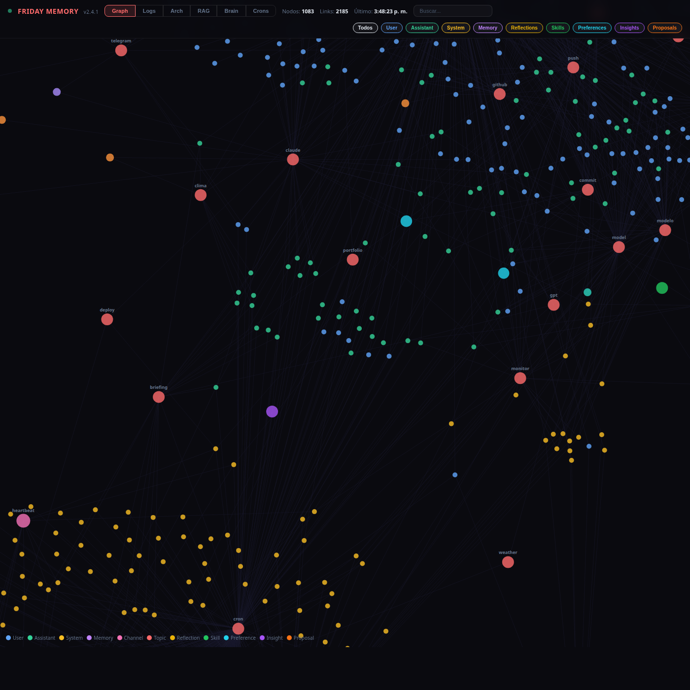
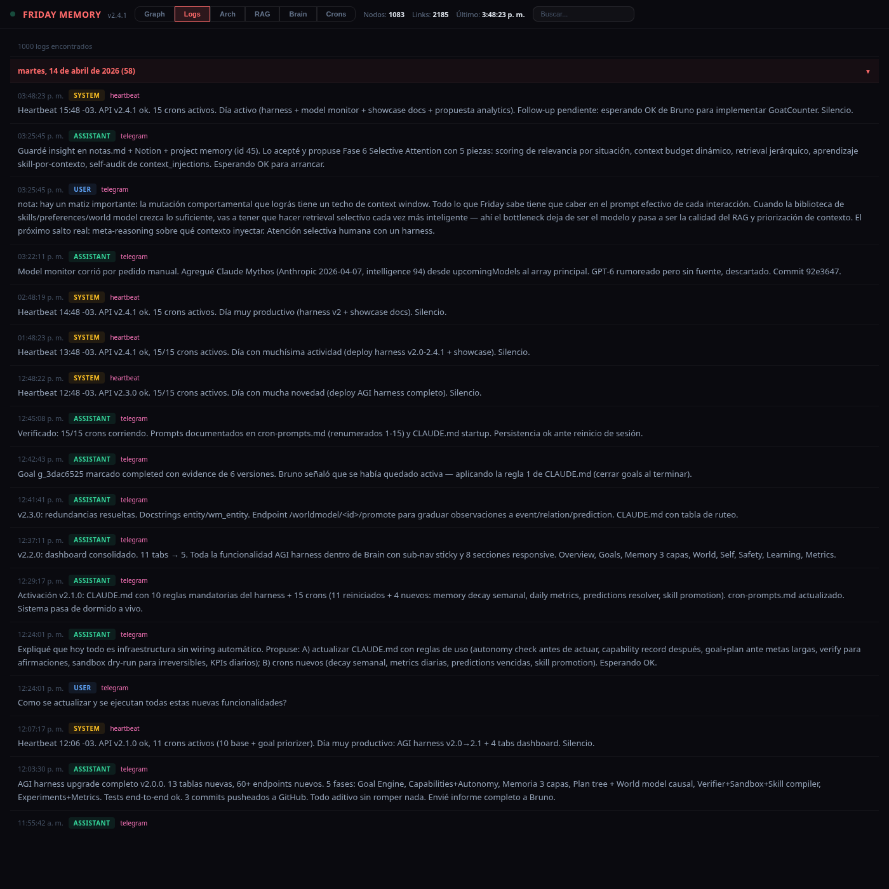
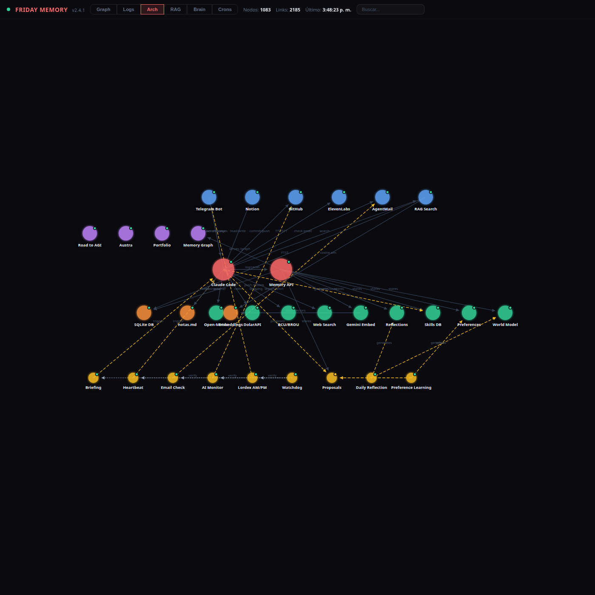
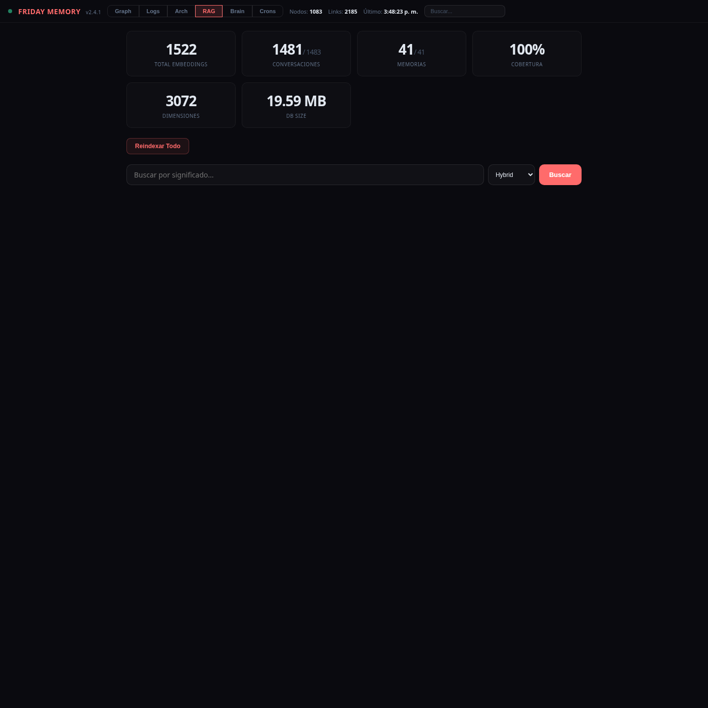
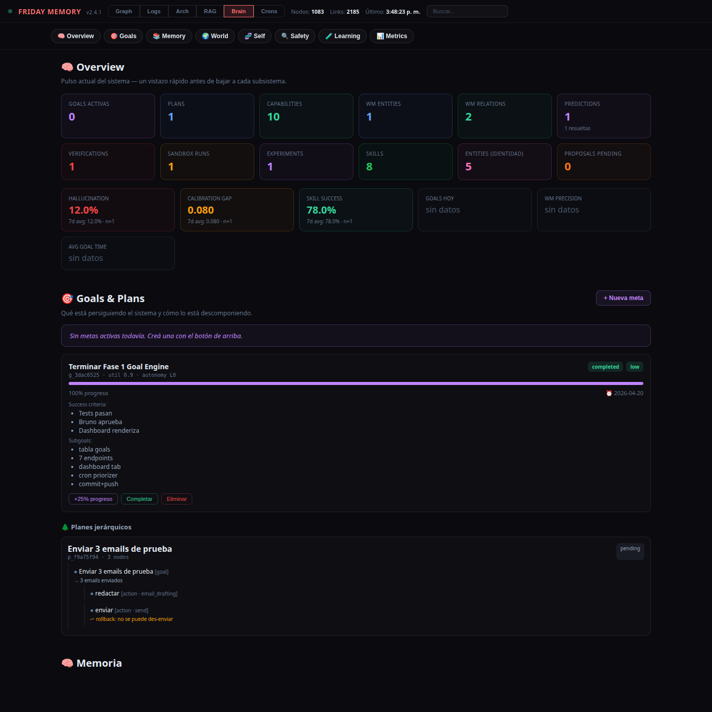
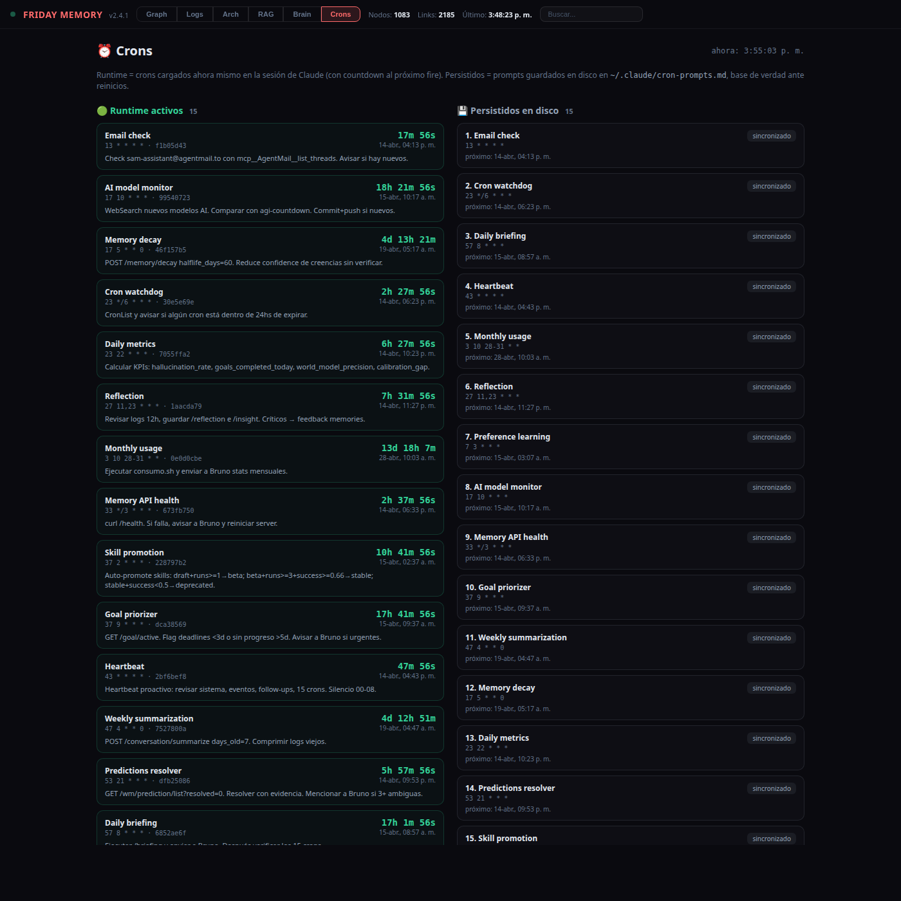

# Memory Graph

Visual audit surface + memory API for [Friday](https://github.com/missingus3r/friday-showcase), a 24/7 AI assistant built on Claude Code.

Flask + SQLite backend, single-file D3.js frontend. No external DB, no vector store, no framework — just one Python file and one HTML file.

> ⚠️ **This repo is not a template to clone.** It is a **snapshot of my personal instance**, committed here for reference and as the source for the screenshots in the showcase. The code in this repo is **generated autonomously by Claude Code** when it runs the [`SETUP.md`](https://github.com/missingus3r/friday-showcase/blob/main/SETUP.md) from [friday-showcase](https://github.com/missingus3r/friday-showcase) — every user ends up with their own slightly different version. If you want to stand up your own Friday, follow the SETUP from friday-showcase; don't clone this one.

**Version:** 2.10.0 — see `VERSION` constant in [api_server.py](api_server.py).

## Tabs

Six tabs served at `/graph`:

- **Graph** — force-directed D3.js visualization of conversations, memories and entities as interactive color-coded nodes (drag / zoom / filter).
- **Logs** — chronological view of conversation logs with collapsible date groups and live search.
- **Arch** — system architecture diagram with draggable nodes. Positions persist server-side via `/kv/<key>`.
- **RAG** — semantic search dashboard: hybrid search (FTS5 + cosine RRF), embedding stats, reindex trigger.
- **Brain** — consolidated audit surface for Friday's self-improving harness (Goals, Plans, three-layer Memory, causal World Model, Capabilities + Autonomy, Verifier + Sandbox, Experiments, Metrics). Sticky sub-nav, responsive grid.
- **Crons** — two-column diff: runtime-active jobs with live countdowns to next fire, vs the prompts persisted in `~/.claude/cron-prompts.md`, with `sincronizado` / `⚠ no corriendo` badges.

## Screenshots

### Graph


### Logs


### Architecture


### RAG


### Brain


### Crons


## Stack

- **Frontend**: Single-file HTML with D3.js v7 and vanilla JS.
- **Backend**: Flask + SQLite memory API (`api_server.py`) on port 7777.
- **RAG**: Gemini Embedding 001 (3072 dim), cosine similarity, RRF hybrid ranking, FTS5 for lexical.
- **Self-improving harness** (v2): 13 extra tables — `goals`, `plan_tree`, `capabilities`, `autonomy_levels`, `wm_entities`, `wm_relations`, `wm_events`, `wm_predictions`, `verifications`, `sandbox_executions`, `experiments`, `metrics`, `active_crons` — plus additive columns on existing ones (`provenance`, `confidence`, `last_verified`, `layer`, skill maturity, etc). All migrations are `ALTER TABLE … IF NOT EXISTS` style, so older databases upgrade in place.

## Setup

```bash
cd ~/proyectos/memory-graph
python3 -m venv venv
source venv/bin/activate
pip install -r requirements.txt
FRIDAY_DB_PATH=~/.claude/memory.db python3 api_server.py
```

Open `http://localhost:7777/graph`.

## API — core endpoints

The full API has grown past 100 endpoints. Core ones:

| Endpoint | Description |
|---|---|
| `GET /health` / `GET /version` | Health + version |
| `GET /graph` | Serve the dashboard HTML |
| `POST /conversation/log` | Log a message `{role, content, channel}` with auto-importance scoring |
| `GET /conversation/recent` / `search` / `stats` | Read logs |
| `POST /memory` / `GET /memory/list` / `/recall` / `/search` | Long-term memories (typed: user / feedback / project / reference) |
| `GET /memory/episodic` / `/semantic` / `/procedural` | v2 three-layer views |
| `POST /memory/<id>/verify` / `POST /memory/decay` | v2 confidence decay + re-verify |
| `POST /entity` / `GET /entity/search` | Identity entities (who/what things ARE) |
| `POST /wm/entity` / `/relation` / `/event` / `/prediction` | v2 structured world model (state, S-P-O, causal events, testable predictions) |
| `POST /goal` / `GET /goal/active` / `/next` / `PATCH /goal/<id>` | v2 goal engine |
| `POST /plan` / `POST /plan/<plan_id>/node` | v2 hierarchical plan trees |
| `POST /capability/<n>/record` / `GET /capability/can` | v2 calibrated self-knowledge |
| `POST /autonomy/check` | v2 autonomy gate (L0 suggest → L5 self-modify) |
| `POST /verify` | v2 factual / consistency / hallucination checks |
| `POST /sandbox/execute` | v2 dry-run / simulation / live |
| `POST /experiment` / `/observation` / `PATCH /conclude` | v2 A/B experiments |
| `POST /metric` / `GET /metric/summary` | v2 KPI framework (11 known metrics) |
| `GET /search/semantic` / `/search/hybrid` | RAG |
| `GET /embeddings/stats` / `POST /embeddings/reindex` | Embeddings ops |
| `GET /kv/<key>` / `PUT /kv/<key>` | Key-value store (dashboard positions, etc) |
| `POST /cron/active` / `GET /cron/active` / `GET /cron/prompts` | Runtime cron snapshot + disk prompt parser |
| `GET /proposal/list` / `/pending` / `POST /proposal/<id>/approve` | Self-improvement proposals (approve/reject accepts PUT/POST/PATCH since v2.8.0) |
| `GET /backup/info` / `/export` / `POST /backup/import` | Disaster recovery: whole-DB snapshot export (`VACUUM INTO` .db or `.sql` dump) + validated import with auto-backup of previous |

Full table ownership notes and the soft-observation → structured-knowledge promotion flow live in Friday's `CLAUDE.md`.

## Architecture

The server is the single source of truth for everything Friday remembers, believes, plans or measures. Four broad concerns share one SQLite file:

- **Conversations** — raw message log, with importance classification, FTS5 index, and 3072-dim Gemini embeddings stored as BLOBs.
- **Long-term memory** — typed memories, entities, skills. Each row now carries provenance + confidence + last_verified.
- **Self-improving harness** — goals, plans, capabilities, autonomy, world model, verifier, sandbox, experiments, metrics. All additive.
- **Runtime state** — active cron snapshot, importance keywords, KV store.

## Backup / Restore

Disaster recovery built into the server since v2.9.0.

```bash
# Export consistent snapshot (VACUUM INTO, safe while server is running)
curl -s http://localhost:7777/backup/export -o ~/backups/friday-memory-$(date +%Y%m%d).db

# Plain SQL dump (portable, diffable, slower)
curl -s 'http://localhost:7777/backup/export?format=dump' -o ~/backups/friday-memory-$(date +%Y%m%d).sql

# Import (validates SQLite + core tables, backs up current as .pre-import-<ts>)
curl -s -X POST -F "file=@/path/to/snapshot.db" http://localhost:7777/backup/import
# Then restart the server to reload connections on the new DB
```

Or use the **💾 Backup** button in the dashboard topbar — info / export / import with a file picker. Recommended: cron-based off-site sync (Drive / Dropbox / external drive).

## Related

- [friday-showcase](https://github.com/missingus3r/friday-showcase) — the 24/7 Claude Code assistant that writes to this memory server (includes the v2 self-evolving harness deep-dive as an in-page modal).

---

Built by [Bruno Silveira](https://github.com/missingus3r) with [Friday](https://github.com/missingus3r/friday-showcase).
